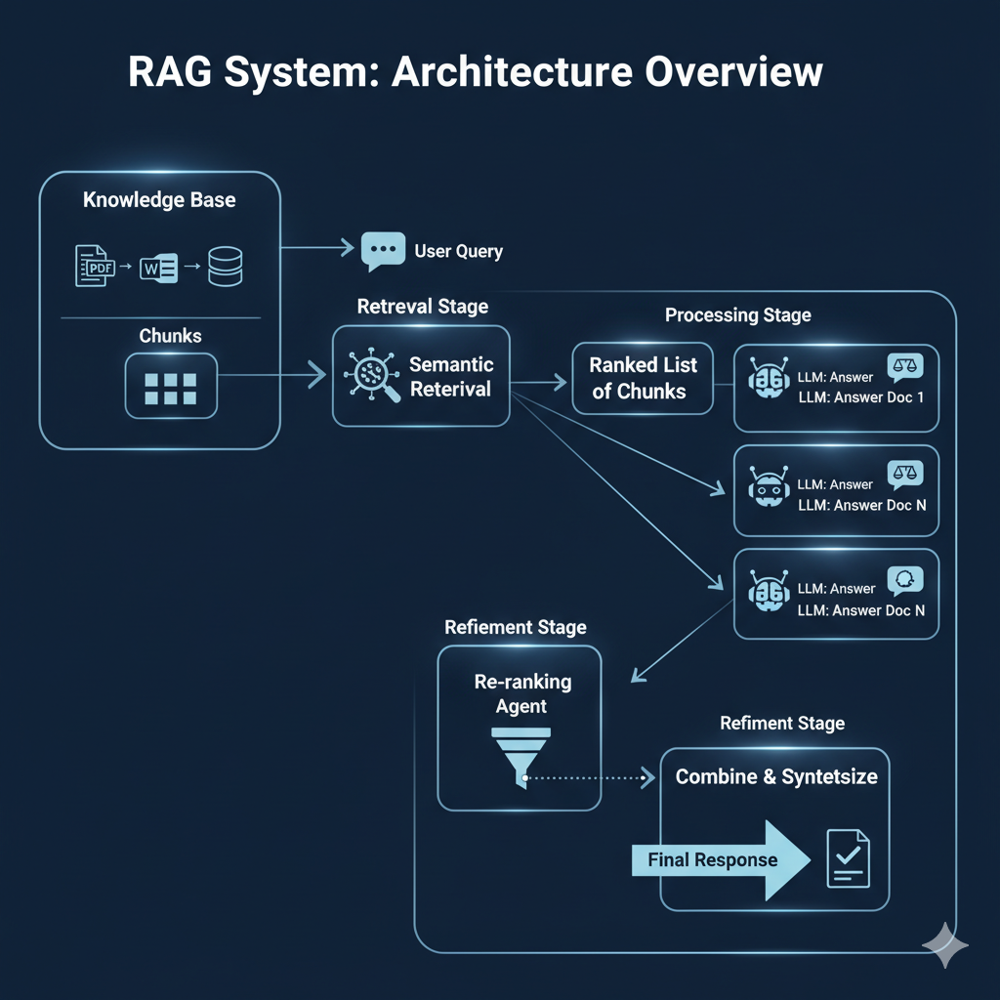

# Agentic Retrieval and Chat (ARC)  

**ARC** is an OFFLINE local Agentic Retrieval system for document parsing and RAG based conversation. It is a minimalistic Document parsing (PDF) and Question-Answering system using open-source low resource models (VLM, LLM).  

It can be used with Scientific Papers (PDF) to sort through relevant information and find any complex queries, without going through massive volume of text.  


## *Update*  

* **03/02/2026**: (CHAT module)  
  - Updated similarity search function to improve chunk selection.  
  - Added **Late Chunking** and reduced memory requiremnts during text similarity search.  
  - Added *'Pydantic'* schema rule for strict response format in Query Analyzer.  
* **04/02/2026**:  
  - Added sub-query response summarization to generate final response for each doc.  
  - Integrated "Extraction" module into *main*.  


## Overview  

It is a 2 Stage application.  

The ***EXTRACTION*** module extracts text, image, tables and other metadata from a PDF (preferably scientific paper) and saves the data. The `.json` file contains all the textual data and metadata including a summary of the paper. It works well with Scientific Papers.   

The ***CHAT*** module acts as an **Agent** and scans through the files, to find relevant text chunks and also generates answers for each query/meta-queries. It uses Reasoning, non-Reasoning models, semantic embedding match and chunk re-ranking, to analyze the user query and generate response.   


<!-- Process flow can be summarized as:  

...  -->


Implemented a Forward-Pass Response generation system, where we avoid data de-duplication using LLM. For selecting relevant chunks __*Semantic Late-Chunking*__ and __*(Ranking + re-Ranking)*__ strategy has been implemented, which provides much accurate data and reduces memory requirements.  

Finally, a per-document score is generated to get the relevance based on the query and search requirement.  




*Generated by Gemini*  


### Keep in mind  

1) This was built for local GPU powered device usage in mind. Hence, "**max. each model parameter recommended is 4B**"  
2) At the moment Qwen3 and Gemma3 models perform relatively better at instruction following. By *default* one should choose **Qwen3** at the moment to avoid hallucinations for query analysis.  
3) Reasoning mode has been turned **OFF** at the moment.  
4) Some complex queries can take much longer (~5-10 mins).  


## Features  

* Smart Query Analysis for semantic information search and targetted document analysis.  
* No Vector Database required. Vector similarity is used on the fly. In production setting, SQL or NoSQL database will suffice. Hence, making it easy to integrate with existing systems, without increasing system overhead.  
* Prompt-free PDF parsing. You can also parse 1 single pdf which can be used for targetted information retrieval.  
* Decoupled Parsing and Coversation stage, which enables flexible Agentic integration into AI assistants.  


It has the potential to be used for newer SOTA process and frameworks for Agentic RAG (ReACT, keyword + reasoning, etc.)  


__Current Limitations__  

* Max 15-20 pages can be handled effectively by the **CHAT** system, due to context length limitations.  
* No chat memory at the moment (single question-answer)  

Unpredictability in LLM output can sometime raise Errors. Please re-run in that case with little re-phrasing of the original query.

Works perfectly with 1-line query. Multi-line query supported too.  


## Installation  

__Step 1 (python setup)__  
This setup is for `venv` based installation,  

1. Virtual Environment Setup:  
    Windows (10/11)  
    ```bash 
    python -m venv .venv 
    .venv/Scripts/activate.bat
    ```
    OR,
    Linux  
    ```bash  
      python -m venv .venv
      .venv/bin/activate
    ```  

3. Dependency installation:  
  - For Linux OS (Ubuntu >=22.0):  
    ```bash 
      dep_install_linux.sh
    ```  
  - For Windows OS (>=10.0):  
    ```bash 
      dep_install_windows.bat
    ```  

__Step 2 (ollama setup)__  

* Install [Ollama](https://github.com/ollama/ollama)  
* Pull the model: `ollama pull llama3.2` (current list can be found at *main.py*)  


### Required models (Ollama)  

Following models have shown solid performance within (6 - 8) GB GPU system, for both *Extraction* and *Chat* modules.  

1) `gemma3:4b`  
2) `qwen3:4b`   


Model Context Length required: >=**20K**  


## Usage Instruction  

### Extraction  

Drop your PDFs inside a folder in */sample_docs* and update the destinations in `main.py`.  

Use the `run_extraction(...)` function in `main.py` to parse the PDFs. You can use `page_limit` and `target_pdf` for selective extraction.  

```python 
## EXTRACTION module ## 
extracted_file_names = run_extraction(pdf_src_path, pdf_dest_dir, json_path, page_limit=5) 
```  

Use the output in */sample_docs/json* directory for active information retrieval in ***CHAT*** module.  


### Chat  
After extracting the PDF data and metadata you can chat with the `.json` files using the `run_chat(...)` function in `main.py`.  

```python
## CHAT module ## 
user_input = "Find the main authors of all the research papers in the document collection." 
run_chat(user_input, json_path) 
```  

You can use any `.json` file for this functionality but have to follow the following schema:  

```json
{
  "Title": "JPEG INSPIRED DEEP LEARNING",
  "File_Name": "Squad_dataset.pdf",
  "Section 0": {
    "Text": "The Normans (Norman: Nourmands; ...",
  },
  "Section 1": {
    "Text": "The United Kingdom is the fourth largest exporter of goods ...",
    "Image_paths": [],
    "Image_captions": [],
    "Tables": [],
    "Table_captions": [],
    "Equations": {}
  },
}
```  

HuggingFace and Sentence-Transformer models will be auto downloaded the first time. Later you can run it totally OFFLINE.  

## Run  

* First start Ollama server irrespective of which module you run: `ollama serve`  

* In `main.py`, select which module to run and update the following variables:  
  1) `pdf_src_path`, `pdf_dest_dir`, `json_path`   
  2) `ModelsQA` and `ModelsQueryAnalysis`  
  3) Enter your query in `user_input`  

Finally >>> `python main.py`  


```python
def main():
    pdf_src_path = os.path.abspath("sample_docs/pdf") 
    pdf_dest_dir = os.path.abspath("sample_docs/pdf_output") 
    json_path = os.path.abspath("sample_docs/JSON") 

    os.makedirs(pdf_dest_dir, exist_ok=True) 
    os.makedirs(json_path, exist_ok=True) 

    ## EXTRACTION module ## 
    extracted_file_names = run_extraction(pdf_src_path, pdf_dest_dir, json_path) 

    ## CHAT module ## 
    user_input = "Find the main authors of all the research papers in the document collection." 
    run_chat(user_input, json_path) 

    
    return 

```


### Sample Queries  

***Worked***:  
* What's (2^4 + 2^3 - 76 + 9) ?  
* Summarize the information in 2410.07081v3_parsed.json  
* summarize all the documents.  
* Which files mention JPEG compression in deep learning context?  
* Summarize these files: [arxiv_21345v2.json, 2410.07081v3_parsed.json]  
* Is there any reference to adversarial attacks on vision deep learning model?  
* If I used deep learning models without image compression, will my performance be better?  
* Do 2410.07081v3_parsed.json and squad_passage.json deals with JPEG compression?  

General Qs for any json file (SQUAD dataset),  
* In what country is Normandy located?  
* What century did the Normans first gain their separate identity?  
* By what main attribute are computational problems classified utilizing computational complexity theory?  


***Partially Correct***  
* Find all the github links. Find if the current document is a research paper.   


## Local Hardware Requirements (baseline)  

**CPU RAM**: >=20GB  
**GPU VRAM**: 6-8GB (NVIDIA CUDA compatibile)  


________ 

Special Thanks to [@Qwen3](https://github.com/QwenLM/Qwen3) and [@gemma](https://github.com/google-deepmind/gemma) teams for building efficient and high-quality low-resource usage models. 

This version uses #HuggingFace and #Ollama for local OFFLINE usage.  


